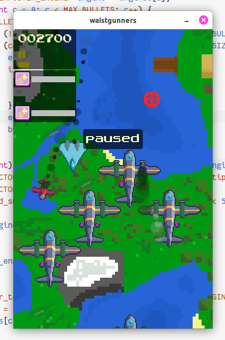

# Waistgunners

A game, still buggy, still in development.

On this branch, the game is being rewritten in Swift.

If you're curious, head over to Releases to grab the latest binary.

## Compiling

To compile on Linux, run:

`swift build -Xcc="-lallegro -lallegro_font -lallegro_primitives -lallegro_audio -lallegro_acodec -lallegro_image -lm"`

## Credits

- Art (c) Chaidan

- programmming by clocks-in-a-cooler

&mdash; _FMM Game Dev Club_
